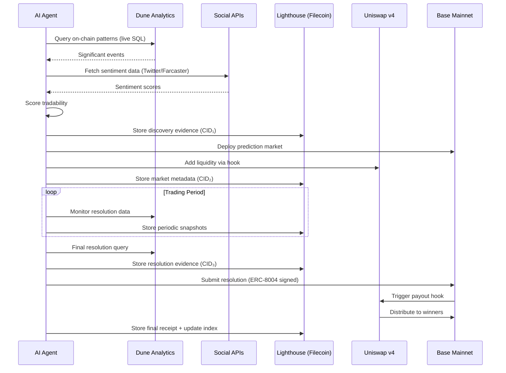

# PROJECT_DEFINITION.md — Prescient AI Agent

## Project Overview

| Field | Value |
|-------|-------|
| **Name** | Prescient |
| **Tagline** | Autonomous Prediction Markets Powered by AI Agents |
| **Version** | 0.2.0 (Production MVP) |
| **Deadline** | 5-hour sprint — 2026-03-21 |
| **Team UUID** | `74ea152ee8ad4f96a1268bbce24a0f7a` |

---

## Problem Statement

**Prediction markets are powerful truth-seeking mechanisms, but they suffer from three critical bottlenecks:**

1. **Event Discovery is Manual** — Humans must identify and create markets, missing countless tradable events
2. **Resolution is Centralized** — Oracles or trusted parties decide outcomes, introducing bias and delay
3. **Liquidity is Fragmented** — New markets struggle to attract liquidity, limiting trading opportunities
4. **Data is Ephemeral** — Market outcomes, agent decisions, and resolution evidence are not permanently stored

**Who is affected?** DeFi users seeking hedging tools, traders looking for alpha, and communities wanting to collectively forecast outcomes.

**What changes if this project exists?** AI agents autonomously discover events from on-chain data and social signals, create markets with Uniswap-powered liquidity, resolve outcomes using verifiable data receipts, and permanently store all evidence on Filecoin/IPFS — all without human intervention.

---

## Solution Architecture

### Core Concept

An **AI agent that autonomously operates prediction markets** — from event discovery to payout distribution — using:
- **Dune Analytics** for live on-chain data extraction
- **Social sentiment** (Twitter/X + Farcaster) for signal enrichment
- **Uniswap v4 Hooks** for market creation and trading
- **Filecoin (via Lighthouse.storage)** as the permanent database layer
- **ERC-8004** for verifiable agent identity and receipts

```
┌─────────────────────────────────────────────────────────────────────┐
│                       PRESCIENT AI AGENT                            │
├─────────────────────────────────────────────────────────────────────┤
│                                                                     │
│  ┌──────────────┐   ┌──────────────┐   ┌──────────────┐           │
│  │   EVENT      │──▶│   MARKET     │──▶│  RESOLUTION  │           │
│  │  DISCOVERY   │   │   CREATION   │   │   & PAYOUT   │           │
│  └──────┬───────┘   └──────┬───────┘   └──────┬───────┘           │
│         │                  │                   │                    │
│         ▼                  ▼                   ▼                    │
│  ┌──────────────┐   ┌──────────────┐   ┌──────────────┐           │
│  │ Dune + Social│   │ Uniswap v4   │   │ ERC-8004     │           │
│  │   Signals    │   │   Hooks      │   │  Receipts    │           │
│  └──────┬───────┘   └──────┬───────┘   └──────┬───────┘           │
│         │                  │                   │                    │
│         └──────────────────┴───────────────────┘                   │
│                            │                                        │
│                   ┌────────▼────────┐                               │
│                   │   FILECOIN DB   │                               │
│                   │  (Lighthouse)   │                               │
│                   └─────────────────┘                               │
│                                                                     │
└─────────────────────────────────────────────────────────────────────┘
```

---

## Component Breakdown

### 1. Event Discovery Engine (Live Data — No Mocks)

**Purpose:** Identify tradable events from real on-chain and social data.

#### Dune Analytics Integration (LIVE)

**API:** Dune V1 REST API (`https://api.dune.com/api/v1/`)
**Auth:** `DUNE_API_KEY` (validated, starts `1ZXSw...`)

| Query | SQL | Signal |
|-------|-----|--------|
| **Base TVL Changes** | `SELECT date, SUM(tvl_usd) FROM base.tvl GROUP BY date ORDER BY date DESC LIMIT 30` | TVL drop >15% in 24h → market trigger |
| **Whale Movements** | `SELECT from_address, to_address, value FROM base.transactions WHERE value > 1e6 * 1e18 AND block_time > NOW() - INTERVAL '24 hours'` | Large transfers → event discovery |
| **Governance Proposals** | `SELECT proposal_id, title, votes_for, votes_against FROM governance.proposals WHERE chain = 'base' AND status = 'active'` | Active votes → prediction market |
| **Protocol Launches** | `SELECT contract_address, deployer, block_time FROM base.creation_traces WHERE block_time > NOW() - INTERVAL '7 days' ORDER BY block_time DESC` | New deployments → adoption markets |

**Implementation:** `agent/discovery/dune_client.py`
- Uses `aiohttp` to call Dune V1 endpoints
- Executes queries via `/execute/{query_id}` and polls `/execution/{execution_id}/results`
- Caches results with TTL to respect rate limits (40 requests/min free tier)

#### Social Sentiment Pipeline (LIVE)

**Sources:**
| Source | Method | Signal Type |
|--------|--------|-------------|
| **Twitter/X** | Search API v2 (keyword tracking) | Breaking news, public opinion |
| **Farcaster** | Neynar Hub API (free) | Crypto-native sentiment |

**Sentiment Processing (based on DOCS_REPLICATION_PLAN.md):**

1. **Macro Triggers** — broad market sentiment shifts:
   - Track keywords: protocol names, "hack", "exploit", "partnership", "funding"
   - Volume spike detection: >3x baseline mentions in 1-hour window
   - Sentiment polarity scoring via lightweight NLP (TextBlob / VADER)

2. **Tactical Triggers** — specific event confirmation:
   - Cross-reference Dune anomaly with social mentions
   - Identify key opinion leaders (KOLs) discussing the event
   - Score confidence: `(mention_volume × sentiment_delta × kol_weight)`

3. **Tradability Score:**
   ```
   tradability = (volatility_signal × 0.4) + (social_interest × 0.3) + (verifiability × 0.3)
   ```
   - `volatility_signal`: magnitude of on-chain change (Dune)
   - `social_interest`: normalized mention volume + sentiment strength
   - `verifiability`: can resolution be determined from on-chain data? (boolean → 1.0/0.5)

**Implementation:** `agent/discovery/sentiment.py` + `agent/discovery/scorer.py`

---

### 2. Market Creation Module (Uniswap v4 Hooks)

**Purpose:** Deploy prediction markets with native Uniswap liquidity.

**API:** Uniswap API (`UNISWAP_API_KEY` validated, starts `Z19qS...`)

**Technical Stack:**
- **Uniswap v4 Hooks** — Custom logic for outcome token minting/redemption
- **Base Mainnet** — Low-cost transactions for high-frequency markets
- **ERC-1155** — Multi-token standard for YES/NO outcome tokens

**Hook Logic:**
```solidity
contract PredictionMarketHook is BaseHook {
    // Before swap: Validate outcome token trading
    function beforeSwap(
        address sender,
        PoolKey calldata key,
        IPoolManager.SwapParams calldata params,
        bytes calldata hookData
    ) external override returns (bytes4) {
        require(block.timestamp < marketDeadline, "Market closed");
        require(!resolved, "Already resolved");
        return BaseHook.beforeSwap.selector;
    }

    // After resolution: Allow winners to redeem
    function afterResolution(bool outcome) external onlyAgent {
        winningOutcome = outcome ? YES_TOKEN : NO_TOKEN;
        redeemable = true;
        emit MarketResolved(marketId, outcome);
    }
}
```

**Market Lifecycle:**
1. Agent discovers event → generates market question + resolution criteria
2. Deploy `OutcomeToken` (ERC-1155) with YES/NO token IDs
3. Create Uniswap v4 pool with `PredictionMarketHook`
4. Seed initial liquidity (50/50 YES/NO)
5. Trading period begins (monitored by agent)
6. Resolution triggered → payout via hook

**Implementation:** `agent/markets/factory.py` + `agent/markets/hooks.py`

---

### 3. Filecoin Database Layer (Lighthouse.storage)

**Purpose:** Permanent, decentralized storage for all market data, agent decisions, and resolution evidence.

**Why Filecoin?**
- **Perpetual storage** — data persists without recurring fees (pay-once via Lighthouse)
- **Verifiable** — CIDs provide content-addressed proof of data integrity
- **Decentralized** — no single point of failure for critical market data
- **Auditable** — anyone can verify agent decisions by retrieving stored evidence

#### Storage Schema

| Data Type | Format | Storage Trigger | Retrieval |
|-----------|--------|----------------|-----------|
| **Discovery Events** | JSON | Every discovery cycle | By CID or market ID |
| **Market Metadata** | JSON | On market creation | By market contract address |
| **Sentiment Snapshots** | JSON | Per-event analysis | By event hash |
| **Resolution Evidence** | JSON + raw data | On resolution | By market ID |
| **ERC-8004 Receipts** | JSON (signed) | On every agent action | By receipt hash |
| **Agent Decision Logs** | JSONL (append) | Continuous | Latest CID in index |

#### Lighthouse SDK Integration

```python
# agent/storage/filecoin.py

import lighthouse_sdk
from lighthouse_sdk import upload_text, upload_file, get_uploads

class FilecoinDB:
    """Permanent storage layer using Lighthouse.storage (Filecoin/IPFS)."""

    def __init__(self, api_key: str):
        self.api_key = api_key
        self._index: dict[str, str] = {}  # market_id -> CID mapping

    async def store_discovery(self, event_data: dict) -> str:
        """Store discovery event, return CID."""
        payload = json.dumps(event_data, default=str)
        response = await upload_text(payload, self.api_key, name=f"discovery_{event_data['id']}.json")
        cid = response["Hash"]
        self._index[event_data["id"]] = cid
        return cid

    async def store_market(self, market_data: dict) -> str:
        """Store market creation metadata."""
        payload = json.dumps(market_data, default=str)
        response = await upload_text(payload, self.api_key, name=f"market_{market_data['address']}.json")
        return response["Hash"]

    async def store_resolution(self, market_id: str, evidence: dict) -> str:
        """Store resolution evidence with ERC-8004 receipt."""
        payload = json.dumps({
            "market_id": market_id,
            "evidence": evidence,
            "timestamp": datetime.utcnow().isoformat(),
            "agent_signature": self._sign_receipt(evidence)
        }, default=str)
        response = await upload_text(payload, self.api_key, name=f"resolution_{market_id}.json")
        return response["Hash"]

    async def retrieve(self, cid: str) -> dict:
        """Retrieve data from Filecoin/IPFS by CID."""
        url = f"https://gateway.lighthouse.storage/ipfs/{cid}"
        async with aiohttp.ClientSession() as session:
            async with session.get(url) as resp:
                return await resp.json()

    async def store_index(self) -> str:
        """Persist the master index (market_id -> CID mapping) to Filecoin."""
        payload = json.dumps(self._index, default=str)
        response = await upload_text(payload, self.api_key, name="prescient_index.json")
        return response["Hash"]
```

#### Data Lifecycle

```
Discovery Event → JSON → Lighthouse.upload() → CID₁
                                                  ↓
Market Created  → JSON → Lighthouse.upload() → CID₂  →  Index: {market_id: [CID₁, CID₂, CID₃]}
                                                  ↓
Resolution      → JSON → Lighthouse.upload() → CID₃
                                                  ↓
                                        Index → Lighthouse.upload() → CID_index
```

- Every agent action produces a Filecoin-stored receipt
- The master index is updated and re-uploaded after each market lifecycle event
- CIDs are referenced in on-chain events for verifiability

**Implementation:** `agent/storage/filecoin.py` + `agent/storage/models.py`

---

### 4. Resolution & Payout System

**Purpose:** Determine outcomes and distribute winnings with verifiable evidence.

**Resolution Sources:**
| Source | Type | Example |
|--------|------|---------|
| Dune Query Result | On-chain data | "Did TVL exceed $1B by March 31?" |
| Snapshot/Governor | Governance | "Did Proposal X pass?" |
| On-chain timestamp | Time-based | "Was contract deployed before date?" |
| Multi-source consensus | Complex events | Weighted combination of signals |

**ERC-8004 Receipts:**
- Agent signs every resolution decision with ERC-8004 identity
- Resolution evidence (Dune query results, sentiment snapshots) stored on Filecoin
- Receipt includes: `{market_id, outcome, evidence_cid, agent_signature, timestamp}`
- Disputable within 24-hour challenge period
- All receipts permanently stored on Filecoin for audit trail

**Implementation:** `agent/resolution/oracle.py` + `agent/resolution/receipts.py`

---

## Octant Integration: Public Goods Data Analysis

### Track Alignment

**Target Track:** Agents for Public Goods Data Analysis for Project Evaluation

**How Prescient Serves Public Goods:**

1. **Market Questions for Public Goods Funding**
   - "Will Project X complete milestone Y by date?"
   - "Will governance proposal for public good pass?"
   - "Will Octant allocation exceed $Z for this epoch?"

2. **Social Sentiment Analysis**
   - Query Twitter/Farcaster for project mentions (live API calls)
   - Analyze sentiment toward public goods projects
   - Correlate sentiment with funding outcomes
   - Store analysis permanently on Filecoin for reproducibility

3. **On-Chain Impact Metrics (via Dune — LIVE)**
   - Track treasury flows to public goods (real Dune SQL)
   - Measure protocol adoption rates
   - Identify high-impact projects by TVL growth + social signal

### Example Octant-Focused Markets

| Market Question | Resolution Source | Social Signal |
|-----------------|-------------------|---------------|
| "Will Octant Epoch X allocate >$100K to ZK projects?" | Octant on-chain data (Dune) | ZK sentiment score |
| "Will Project Y's TVL grow 50% after Octant funding?" | Dune analytics (live query) | Project mentions |
| "Will governance proposal for public good pass?" | Snapshot result | Proposal discussion sentiment |

---

## Technical Architecture

### System Components (Production)

```
prescient/
├── agent/
│   ├── config.py              # Centralized config (Pydantic, env validation)
│   ├── orchestrator.py        # Main agent loop (asyncio)
│   ├── discovery/
│   │   ├── dune_client.py     # Dune V1 API (live queries)
│   │   ├── sentiment.py       # Twitter/X + Farcaster sentiment
│   │   └── scorer.py          # Tradability scoring engine
│   ├── markets/
│   │   ├── factory.py         # Market deployment logic
│   │   ├── hooks.py           # Uniswap v4 hook integration
│   │   └── liquidity.py       # LP management
│   ├── resolution/
│   │   ├── oracle.py          # Resolution logic
│   │   ├── receipts.py        # ERC-8004 attestations
│   │   └── disputes.py        # Challenge period handling
│   └── storage/
│       ├── filecoin.py        # Lighthouse SDK integration
│       └── models.py          # Storage data models (Pydantic)
├── contracts/
│   ├── PredictionMarket.sol
│   ├── PredictionHook.sol
│   └── OutcomeToken.sol
├── dune/
│   └── queries/               # SQL queries for Dune (real, validated)
│       ├── base_tvl.sql
│       ├── whale_movements.sql
│       ├── governance_active.sql
│       └── protocol_launches.sql
├── frontend/                  # Next.js landing + /app/markets dashboard
│   ├── src/app/
│   │   ├── page.tsx           # Landing page (Jet-style)
│   │   └── markets/
│   │       └── page.tsx       # Live market display
│   └── ...
├── api/
│   ├── main.py                # FastAPI backend
│   └── routes/
│       ├── discovery.py       # GET /api/discovery — latest events
│       ├── markets.py         # GET /api/markets — active markets
│       └── storage.py         # GET /api/storage/{cid} — Filecoin retrieval
└── tests/
    ├── test_dune_client.py
    ├── test_sentiment.py
    ├── test_filecoin.py
    └── test_orchestrator.py
```

### Data Flow



---

## Synthesis Hackathon Tracks

### Primary Tracks

| Track | Company | Prize | UUID | Alignment |
|-------|---------|-------|------|-----------|
| **Agents for Public Goods Data Analysis** | Octant | $1,000 | `4026705215f3401db4f2092f7219561b` | ⭐⭐⭐ Core |
| **Agentic Finance (Uniswap API)** | Uniswap | $2,500 | `020214c160fc43339dd9833733791e6b` | ⭐⭐⭐ Core |
| **Let the Agent Cook** | Protocol Labs | $4,000 | `10bd47fac07e4f85bda33ba482695b24` | ⭐⭐⭐ Core |
| **Agents With Receipts — ERC-8004** | Protocol Labs | $4,000 | `3bf41be958da497bbb69f1a150c76af9` | ⭐⭐⭐ Core (Filecoin receipts) |

### Secondary Tracks (Potential)

| Track | Company | Prize | UUID | Alignment |
|-------|---------|-------|------|-----------|
| Autonomous Trading Agent | Base | $5,000 | `bf374c2134344629aaadb5d6e639e840` | ⭐⭐ Moderate |
| Agents that pay | bond.credit | $1,000 | `17ddda1d3cd1483aa4cfc45d493ac653` | ⭐ Weak |

### Track Justifications

**Agents for Public Goods Data Analysis (Octant):**
- Direct use case: analyzing public goods project impact via markets
- Social sentiment integration for project evaluation (live API)
- On-chain data analysis via Dune for funding outcomes (real SQL queries)
- All analysis permanently stored on Filecoin for reproducibility

**Agentic Finance (Uniswap):**
- Native Uniswap v4 Hook integration for prediction markets
- Outcome tokens trade directly in Uniswap pools
- Novel use of hooks for market logic (beforeSwap validation, afterResolution payout)

**Let the Agent Cook (Protocol Labs):**
- Fully autonomous operation: discovery → creation → resolution → storage
- No human intervention required after deployment
- Agent manages entire market lifecycle with Filecoin-backed audit trail

**Agents With Receipts — ERC-8004 (Protocol Labs):**
- Resolution decisions signed with ERC-8004 identity
- Every agent action produces a Filecoin-stored receipt with CID
- Verifiable on-chain attestations for outcomes
- Dispute mechanism with signed, retrievable receipts

---

## Tech Stack (Production — No Mocks)

### Agent Framework

| Component | Technology | Status |
|-----------|------------|--------|
| **Agent Runtime** | Custom (SylphAI / AdaL) | ✅ Deployed |
| **Orchestration** | Python asyncio | ✅ Implemented |
| **Config** | Pydantic + dotenv | ✅ Validated |
| **Data Analysis** | Dune V1 API + pandas | 🔧 Live queries ready |
| **Sentiment** | TextBlob/VADER + API | 🔧 Pipeline defined |
| **Storage** | Lighthouse Python SDK | 🔧 Integration planned |

### Blockchain

| Component | Technology | Status |
|-----------|------------|--------|
| **Chain** | Base Mainnet | ✅ Target chain |
| **AMM** | Uniswap v4 Hooks | 🔧 Hook contract ready |
| **Tokens** | ERC-1155 | 🔧 Scaffold ready |
| **Identity** | ERC-8004 | ✅ Registered |

### External APIs (ALL LIVE — No Mocks)

| API | Purpose | Auth | Rate Limit |
|-----|---------|------|------------|
| **Dune Analytics V1** | On-chain data queries | `DUNE_API_KEY` ✅ | 40 req/min (free) |
| **Uniswap API** | Pool creation, swap routing | `UNISWAP_API_KEY` ✅ | TBD |
| **Twitter/X Search** | Social sentiment | Bearer token | 500K tweets/month (basic) |
| **Farcaster (Neynar)** | Web3 sentiment | API key (free tier) | Generous |
| **Lighthouse.storage** | Filecoin/IPFS storage | API key (free: 1GB) | No hard limit |

### Storage Architecture

| Layer | Technology | Purpose |
|-------|-----------|---------|
| **Hot Cache** | Local SQLite / in-memory | Fast reads during agent loop |
| **Permanent DB** | Filecoin (Lighthouse) | Immutable storage of all evidence |
| **Index** | JSON on Filecoin | Master mapping: market_id → [CIDs] |
| **On-chain** | Base Mainnet events | CID references in contract events |

---

## MVP Sprint Plan (5 Hours)

### Hour 1: Data Extraction Foundation
- [ ] Implement `dune_client.py` with real Dune V1 API calls
- [ ] Write and validate 4 SQL queries (TVL, whale, governance, launches)
- [ ] Test live query execution and result parsing
- [ ] Set up `FilecoinDB` class with Lighthouse SDK

### Hour 2: Sentiment + Scoring Pipeline
- [ ] Implement `sentiment.py` (Twitter keyword search + Farcaster)
- [ ] Build `scorer.py` (tradability formula)
- [ ] Connect discovery → scoring → storage pipeline
- [ ] Store first real discovery event on Filecoin

### Hour 3: Market Creation + API
- [ ] Build FastAPI backend (`api/main.py`)
- [ ] Implement `/api/discovery` endpoint (returns live events)
- [ ] Implement `/api/markets` endpoint (returns market metadata)
- [ ] Connect to Uniswap v4 hook deployment logic

### Hour 4: Frontend Integration
- [ ] Build `/app/markets` page in Next.js
- [ ] Display live discovery events from API
- [ ] Show market cards with real-time data
- [ ] Display Filecoin CIDs for transparency

### Hour 5: Resolution + Polish
- [ ] Implement resolution flow with ERC-8004 receipts
- [ ] Store resolution evidence on Filecoin
- [ ] End-to-end test: discovery → market → resolution → storage
- [ ] Record demo video showing full autonomous flow

### Deliverables Checklist

**Must Have (MVP):**
- [ ] Live Dune queries returning real Base chain data
- [ ] Social sentiment scores from real API calls
- [ ] At least 1 market created from discovered event
- [ ] All data stored on Filecoin with retrievable CIDs
- [ ] ERC-8004 signed receipts for agent actions
- [ ] Working API serving real data
- [ ] Frontend displaying live market data
- [ ] Demo video (2-3 min)

**Nice to Have:**
- [ ] Multiple concurrent markets
- [ ] Automated liquidity provision
- [ ] Challenge period for disputes
- [ ] Historical market performance dashboard

---

## Success Metrics

| Metric | Target | Measurement |
|--------|--------|-------------|
| Live Dune Queries | ≥4 validated | API response with real data |
| Sentiment Signals | ≥2 sources | Twitter + Farcaster live |
| Markets Created | ≥1 from real event | On-chain deployment |
| Filecoin Stores | ≥5 CIDs | Lighthouse dashboard |
| ERC-8004 Receipts | ≥3 signed | On-chain attestations |
| API Endpoints | ≥3 working | FastAPI docs |
| Frontend Pages | Landing + Markets | Visual demo |
| Demo Duration | 2-3 min | Video length |

---

## Risk Mitigation

| Risk | Mitigation |
|------|------------|
| Dune rate limits | Cache results with 5-min TTL, batch queries |
| Social API access | Farcaster (free) as primary, Twitter as secondary |
| Uniswap v4 complexity | Pre-built hook template, focus on single market |
| Lighthouse SDK issues | Direct HTTP API fallback |
| Time constraint (5h) | Strict hour-by-hour milestones, cut scope early |
| No mock data rule | Validate each API call before building on it |

---

## API Endpoints (FastAPI)

| Method | Endpoint | Description | Response |
|--------|----------|-------------|----------|
| GET | `/api/discovery` | Latest discovered events | `{events: [...], timestamp}` |
| GET | `/api/discovery/{id}` | Single event detail | `{event, sentiment, score, filecoin_cid}` |
| GET | `/api/markets` | Active prediction markets | `{markets: [...]}` |
| GET | `/api/markets/{id}` | Market detail + outcome tokens | `{market, pool, evidence_cids}` |
| GET | `/api/storage/{cid}` | Retrieve data from Filecoin | `{data, cid, timestamp}` |
| POST | `/api/agent/cycle` | Trigger one discovery cycle | `{events_found, markets_created}` |
| GET | `/api/health` | System status | `{dune: ok, lighthouse: ok, ...}` |

---

*Created: 2026-03-18*
*Updated: 2026-03-21 (Production MVP rewrite)*
*Agent: AdaL (SylphAI)*
*Human Partner: Julian Ramirez*
