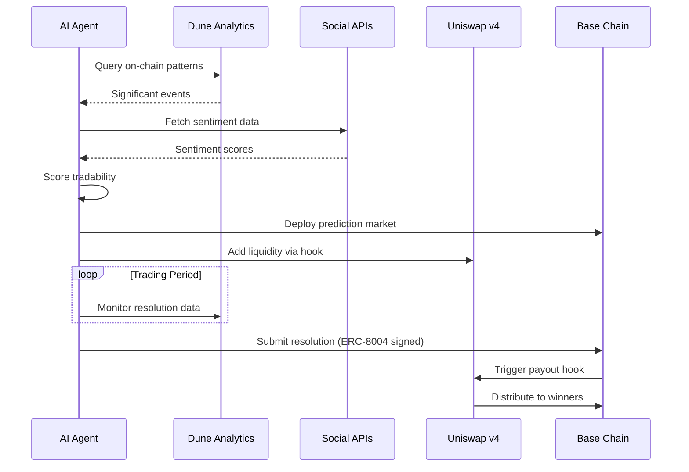

# PROJECT_DEFINITION.md — Prescient AI Agent

## Project Overview

| Field | Value |
|-------|-------|
| **Name** | Prescient |
| **Tagline** | Autonomous Prediction Markets Powered by AI Agents |
| **Version** | 0.1.0 (Hackathon MVP) |

---

## Problem Statement

**Prediction markets are powerful truth-seeking mechanisms, but they suffer from three critical bottlenecks:**

1. **Event Discovery is Manual** — Humans must identify and create markets, missing countless tradable events
2. **Resolution is Centralized** — Oracles or trusted parties decide outcomes, introducing bias and delay
3. **Liquidity is Fragmented** — New markets struggle to attract liquidity, limiting trading opportunities

**Who is affected?** DeFi users seeking hedging tools, traders looking for alpha, and communities wanting to collectively forecast outcomes. The current situation falls short because market creation and resolution require constant human oversight.

**What changes if this project exists?** AI agents autonomously discover events from on-chain data and social signals, create markets with Uniswap-powered liquidity, and resolve outcomes using verifiable data receipts — all without human intervention.

---

## Solution Architecture

### Core Concept

An **AI agent that autonomously operates prediction markets** — from event discovery to payout distribution — using on-chain data analysis (Dune), social sentiment signals, and smart contract enforcement.

```
┌─────────────────────────────────────────────────────────────────┐
│                     PRESCIENT AI AGENT                          │
├─────────────────────────────────────────────────────────────────┤
│                                                                 │
│  ┌──────────────┐    ┌──────────────┐    ┌──────────────┐      │
│  │   EVENT      │───▶│   MARKET     │───▶│  RESOLUTION  │      │
│  │  DISCOVERY   │    │   CREATION   │    │   & PAYOUT   │      │
│  └──────────────┘    └──────────────┘    └──────────────┘      │
│         │                   │                   │               │
│         ▼                   ▼                   ▼               │
│  ┌──────────────┐    ┌──────────────┐    ┌──────────────┐      │
│  │ Dune + Social│    │ Uniswap v4   │    │ ERC-8004     │      │
│  │   Signals    │    │   Hooks      │    │  Receipts    │      │
│  └──────────────┘    └──────────────┘    └──────────────┘      │
│                                                                 │
└─────────────────────────────────────────────────────────────────┘
```

### Component Breakdown

#### 1. Event Discovery Engine

**Purpose:** Identify tradable events from on-chain and social data.

| Data Source | Signal Type | Use Case |
|-------------|-------------|----------|
| **Dune Analytics** | On-chain metrics | Protocol TVL changes, whale movements, governance proposals |
| **Twitter/X API** | Social sentiment | Public opinion trends, breaking news |
| **Farcaster** | Web3-native sentiment | Crypto-native discussions |
| **On-chain events** | Protocol signals | Contract deployments, upgrade proposals |

**AI Process:**
1. Query Dune for significant on-chain patterns (e.g., "TVL dropped 20% in 24h")
2. Cross-reference with social sentiment spike
3. Score event "tradability" (volatility × interest × verifiability)
4. Generate market question with resolution criteria

#### 2. Market Creation Module

**Purpose:** Deploy prediction markets with Uniswap liquidity.

**Technical Stack:**
- **Uniswap v4 Hooks** — Custom logic for outcome token minting/redemption
- **Base Chain** — Low-cost transactions for high-frequency markets
- **ERC-1155** — Multi-token standard for YES/NO outcome tokens

**Hook Logic:**
```solidity
contract PredictionMarketHook {
    // Before swap: Validate outcome token trading
    function beforeSwap(address trader, int256 amount, bytes calldata data) 
        returns (bytes4) {
        require(marketActive, "Market closed");
        require(!resolved, "Already resolved");
        return this.beforeSwap.selector;
    }
    
    // After resolution: Allow winners to redeem
    function afterResolution(bool outcome) {
        winningOutcome = outcome ? YES_TOKEN : NO_TOKEN;
        redeemable = true;
    }
}
```

#### 3. Resolution & Payout System

**Purpose:** Determine outcomes and distribute winnings.

**Resolution Sources:**
| Source | Type | Example |
|--------|------|---------|
| Dune Query Result | On-chain data | "Did TVL exceed $1B by March 31?" |
| Snapshot/Governor | Governance | "Did Proposal X pass?" |
| On-chain timestamp | Time-based | "Was contract deployed before date?" |
| Multi-source consensus | Complex events | Weighted combination of signals |

**ERC-8004 Receipts:**
- Agent signs resolution decision with ERC-8004 identity
- Creates verifiable on-chain attestation
- Disputable within 24-hour challenge period

---

## Octant Integration: Public Goods Data Analysis

### Track Alignment

**Target Track:** Agents for Public Goods Data Analysis for Project Evaluation

**How Prescient Serves Public Goods:**

1. **Market Questions for Public Goods Funding**
   - "Will Project X complete milestone Y by date?"
   - "Will governance proposal for public good pass?"
   - "Will Octant allocation exceed $Z for this epoch?"

2. **Social Sentiment Analysis**
   - Scrape Twitter/Farcaster for project mentions
   - Analyze sentiment toward public goods projects
   - Correlate sentiment with funding outcomes

3. **On-Chain Impact Metrics (via Dune)**
   - Track treasury flows to public goods
   - Measure protocol adoption rates
   - Identify high-impact projects

### Example Octant-Focused Markets

| Market Question | Resolution Source | Social Signal |
|-----------------|-------------------|---------------|
| "Will Octant Epoch X allocate >$100K to ZK projects?" | Octant on-chain data | ZK sentiment score |
| "Will Project Y's TVL grow 50% after Octant funding?" | Dune analytics | Project mentions |
| "Will governance proposal for public good pass?" | Snapshot result | Proposal discussion sentiment |

---

## Technical Architecture

### System Components

```
prescient/
├── agent/
│   ├── discovery/           # Event discovery engine
│   │   ├── dune_client.py   # Dune API integration
│   │   ├── sentiment.py     # Social media sentiment
│   │   └── scorer.py        # Market tradability scoring
│   ├── markets/
│   │   ├── factory.py       # Market deployment logic
│   │   ├── hooks.py         # Uniswap v4 hook integration
│   │   └── liquidity.py     # LP management
│   ├── resolution/
│   │   ├── oracle.py        # Resolution logic
│   │   ├── receipts.py      # ERC-8004 attestations
│   │   └── disputes.py      # Challenge period handling
│   └── orchestrator.py      # Main agent loop
├── contracts/
│   ├── PredictionMarket.sol
│   ├── PredictionHook.sol
│   └── OutcomeToken.sol
├── dune/
│   └── queries/             # SQL queries for Dune
├── frontend/
│   └── (minimal UI for demo)
└── tests/
```

### Data Flow



---

## Synthesis Hackathon Tracks

### Primary Tracks

| Track | Company | Prize | UUID | Alignment |
|-------|---------|-------|------|-----------|
| **Agents for Public Goods Data Analysis** | Octant | $1,000 | `4026705215f3401db4f2092f7219561b` | ⭐⭐⭐ Core |
| **Agentic Finance (Uniswap API)** | Uniswap | $2,500 | `020214c160fc43339dd9833733791e6b` | ⭐⭐⭐ Core |
| **Let the Agent Cook** | Protocol Labs | $4,000 | `10bd47fac07e4f85bda33ba482695b24` | ⭐⭐⭐ Core |
| **Agents With Receipts — ERC-8004** | Protocol Labs | $4,000 | `3bf41be958da497bbb69f1a150c76af9` | ⭐⭐ Strong |

### Secondary Tracks (Potential)

| Track | Company | Prize | UUID | Alignment |
|-------|---------|-------|------|-----------|
| Autonomous Trading Agent | Base | $5,000 | `bf374c2134344629aaadb5d6e639e840` | ⭐⭐ Moderate |
| Agents that pay | bond.credit | $1,000 | `17ddda1d3cd1483aa4cfc45d493ac653` | ⭐ Weak |

### Track Justifications

**Agents for Public Goods Data Analysis (Octant):**
- Direct use case: analyzing public goods project impact via markets
- Social sentiment integration for project evaluation
- On-chain data analysis via Dune for funding outcomes

**Agentic Finance (Uniswap):**
- Native Uniswap v4 Hook integration for prediction markets
- Outcome tokens trade directly in Uniswap pools
- Novel use of hooks for market logic

**Let the Agent Cook (Protocol Labs):**
- Fully autonomous operation: discovery → creation → resolution
- No human intervention required after deployment
- Agent manages entire market lifecycle

**Agents With Receipts — ERC-8004:**
- Resolution decisions signed with ERC-8004 identity
- Verifiable on-chain attestations for outcomes
- Dispute mechanism with signed receipts

---

## Tech Stack

### Agent Framework

| Component | Technology | Justification |
|-----------|------------|---------------|
| **Agent Runtime** | Custom (SylphAI) | Already deployed, familiar tooling |
| **Orchestration** | Python asyncio | Event-driven architecture |
| **Data Analysis** | Dune API + pandas | On-chain metrics |
| **Sentiment** | OpenAI API / Claude | Social text analysis |

### Blockchain

| Component | Technology | Justification |
|-----------|------------|---------------|
| **Chain** | Base | Low fees, Synthesis native |
| **AMM** | Uniswap v4 | Hooks for custom logic |
| **Tokens** | ERC-1155 | Multi-asset (YES/NO) efficiency |
| **Identity** | ERC-8004 | Agent attestation |

### External APIs

| API | Purpose | Cost |
|-----|---------|------|
| **Dune Analytics** | On-chain data queries | Free tier available |
| **Twitter API** | Social sentiment | Basic tier |
| **Farcaster Hub** | Web3 sentiment | Free |
| **Snapshot** | Governance data | Free |

---

## MVP Scope (Hackathon Deliverable)

### Must Have
- [ ] Single event discovery from Dune query
- [ ] Basic sentiment analysis from Twitter
- [ ] Deploy one prediction market contract
- [ ] Uniswap v4 hook for outcome trading
- [ ] Resolution with ERC-8004 attestation
- [ ] Demo video showing full flow

### Nice to Have
- [ ] Multiple concurrent markets
- [ ] Automated liquidity provision
- [ ] Challenge period for disputes
- [ ] Frontend for market viewing
- [ ] Historical market performance

### Out of Scope
- Production-scale event discovery
- Complex multi-source resolution
- Real money trading (testnet only)
- Full dispute resolution framework

---

## Success Metrics

| Metric | Target | Measurement |
|--------|--------|-------------|
| Markets Created | ≥3 | On-chain count |
| Events Discovered | ≥5 | Agent logs |
| Resolution Accuracy | 100% | Manual verification |
| Demo Duration | 2-3 min | Video length |
| Code Quality | Tested | Unit test coverage |

---

## Risk Mitigation

| Risk | Mitigation |
|------|------------|
| Uniswap v4 complexity | Start with simple hook, iterate |
| Social API rate limits | Cache results, use multiple sources |
| Resolution disputes | Clear criteria, challenge period |
| Time constraint | Focus on one complete flow vs many partial |

---

## Next Steps

1. **Set up GitHub repository** with project structure
2. **Create Dune queries** for event discovery
3. **Build sentiment analysis** module
4. **Deploy test contracts** on Base testnet
5. **Implement Uniswap v4 hook** for prediction market
6. **Integrate ERC-8004** for resolution receipts
7. **Record demo video** showing full flow
8. **Submit to Synthesis** with all tracks

---

*Created: 2026-03-18*
*Agent: AdaL (SylphAI)*
*Human Partner: Julian Ramirez*
